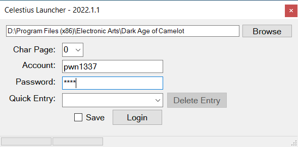
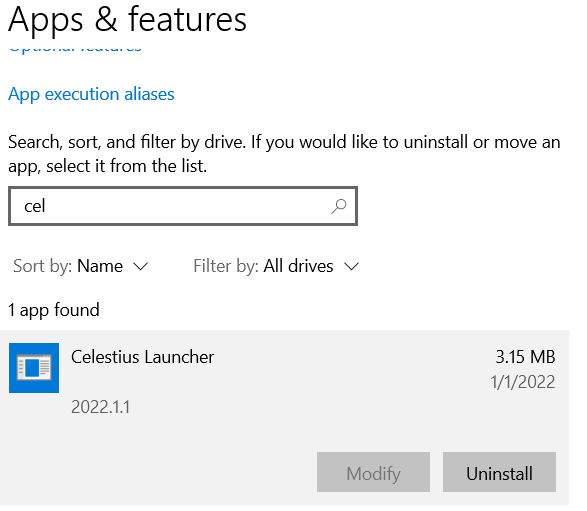

# Celestius Launcher

Game launcher for the [Celestius RvR Freeshard](https://celestiusrvr.com/) server.

  

## How to install the launcher
[Download Setup.exe from the releases page](https://github.com/daoc-celestius/celestius-launcher/releases/latest) and run it.

Installing may trigger various warnings, here is an example of [installing via Chrome](docs/install-chrome.md):

The launcher will install to `%LOCALAPPDATA%\CelestiusLauncher\app-%version%`.

If the launcher does not install and run, your anti-virus may be putting the file in quarantine.  If that happens add a directory exclusion to your virus scanner. For example, user `bob` would add: `C:\Users\bob\AppData\Local\CelestiusLauncher`

## How to uninstall the launcher

Go to Windows | Add or remove programs and search for CelestiusLauncher.

